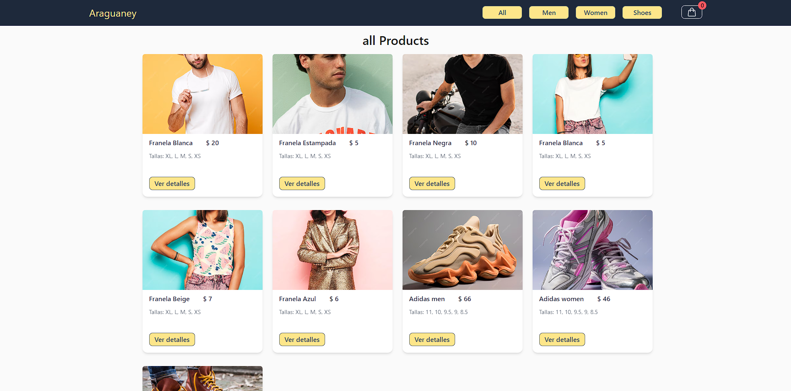
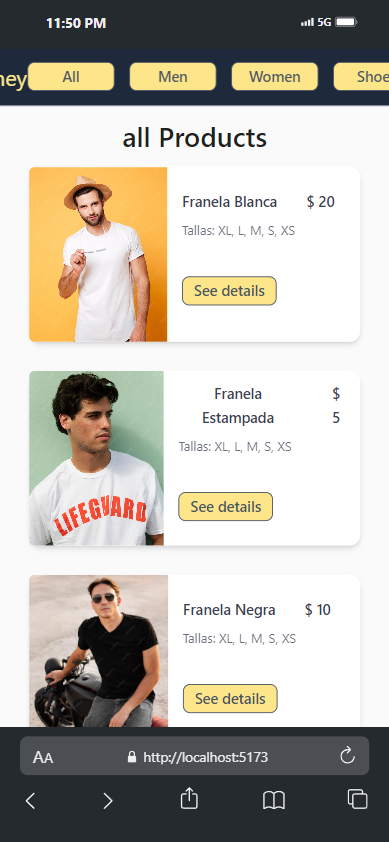

<div>
<p style = 'text-align:center; font-size: 2rem;'>
#Hi, I'm santiago! 👋 <br>
Front-end web development
<p/>
<div/>


# E-Commerce Araguaney

Araguaney is an ecommerce platform based on React js with essential business features.

## Built with:


<div style = 'display:flex; gap:2rem;'>
<h3>- Vite + React - js<h3/>
<p style = 'text-align:start;'>


</p>
</div>


<div style = 'display:flex; gap:2rem;'>
<h3>- React-router-don<h3/>
<p style = 'text-align:start;'>


</p>
</div>


<div style = 'display:flex; gap:2rem;'>
<h3>- React-toastify<h3/>
<p style = 'text-align:start;'>


</p>
</div>

<div style = 'display:flex; gap:2rem;'>
<h3>- Tailwind css<h3/>
<p style = 'text-align:start;'>


</p>
</div>

<div style = 'display:flex; gap:2rem;'>
<h3>- Daisy ui<h3/>
<p style = 'text-align:start;'>


</p>
</div>

<div style = 'display:flex; gap:2rem;'>
<h3>- Firebase<h3/>
<p style = 'text-align:start;'>


</p>
</div>


##

## Installation

Install EntregaFinal-SantiagoYoan-React with npm

```bash
  npm install
```

  Install react-router-dom with npm
```bash
  npm install react-router-dom
``` 

  Install react-toastify with npm
```bash
  npm install --save react-toastify
``` 

  Install react-hook-form with npm
```bash
  npm install react-hook-form
``` 

   Install tailwindcss with npm

```bash
  npm install -D tailwindcss
  npx tailwindcss init
``` 

  Install daisy ui with npm
```bash
  npm i -D daisyui@latest
```

  Install firebase with npm
```bash
  npm install --save firebase
```
## API Reference

#### Get all items

```http
  GET /api/items
```

| Parameter | Type     | Description                |
| :-------- | :------- | :------------------------- |
| `api_key` | `string` | **Required**. Your API key |

#### Get item

```http
  GET /api/items/${id}
```

| Parameter | Type     | Description                       |
| :-------- | :------- | :-------------------------------- |
| `id`      | `string` | **Required**. Id of item to fetch |


## Authors

- [@Unlockeagle](https://github.com/Unlockeagle)


## Demo

<div style = 'display:flex; gap:2rem;'>
<p style = 'text-align:start;'>

</p>

https://entrega-final-santiago-yoan-react.vercel.app/


</div>
<div style = 'display:flex; gap:2rem;'>
<p style = 'text-align:start;'>

</p>
</div>

</div>
<div style = 'display:flex; gap:2rem;'>
<p style = 'text-align:start;'>

</p>
</div>


## Feedback

If you have any feedback, please reach out to us at fake@fake.com

